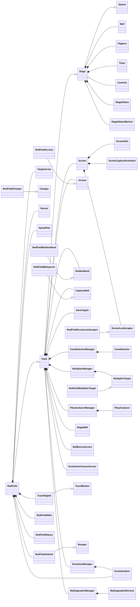
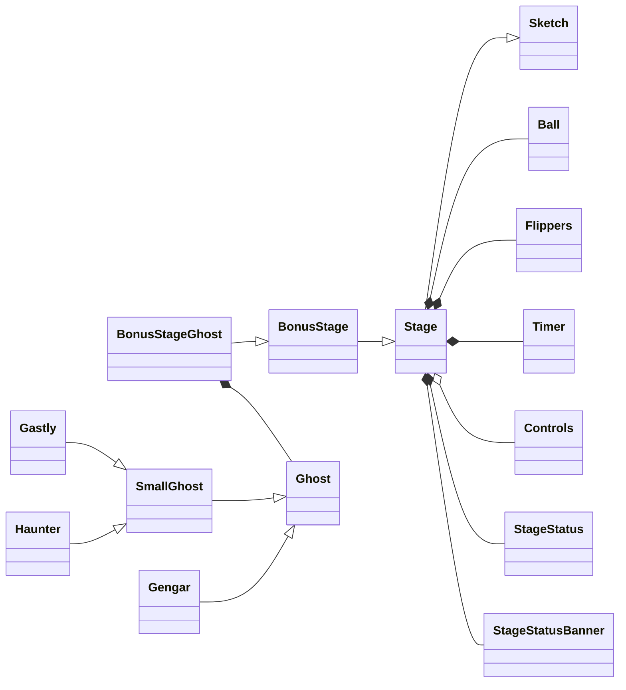
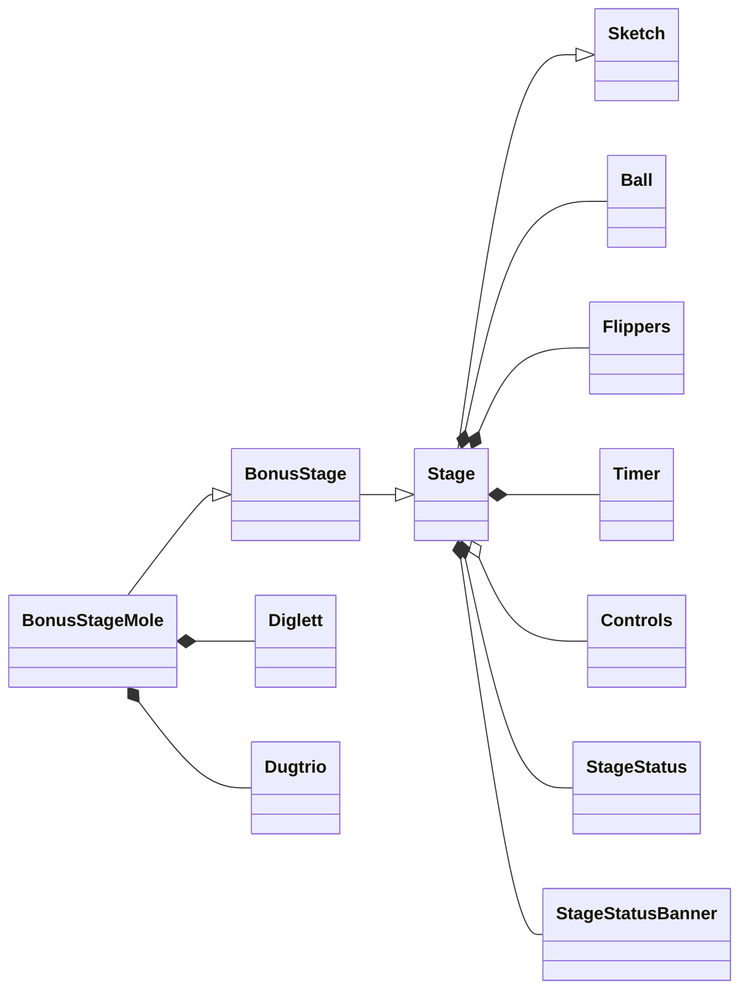
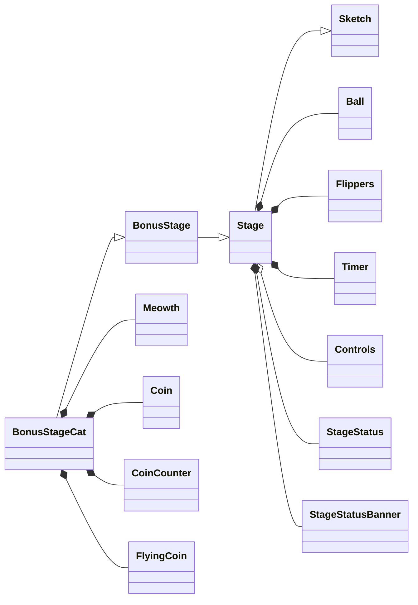
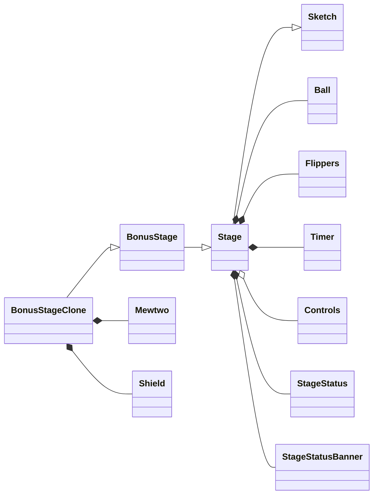
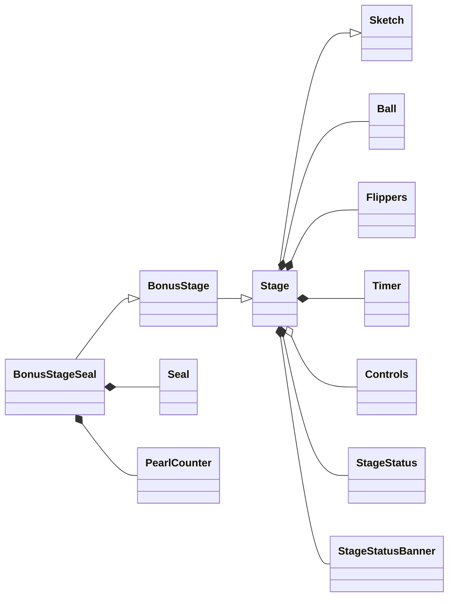

# Pokémon Pinball Remake

Web remake of **Pokémon Pinball** built with p5play.

## Folder Structure (Summary)

```text
code/
	engine/          # EngineUtils, asset/audio/i18n managers, cheats
	core/            # Game foundation: Sketch, Stage, Ball, Controls, Timer...
	fields/          # Main field logic + red/blue variants and managers
	bonus_stages/    # BonusStage and implementations (gengar/diglett/meowth/seel/mewtwo)
	main_menu/       # MainMenu and field selector
	pokedex/         # Pokédex UI and logic
	high_scores/     # High score screen
	main.js          # p5 hooks: preload, setup, draw

assets/
	img/             # sprites, backgrounds, UI
	audio/           # music, sfx
	text/            # translations
```

## Class Diagrams (Mermaid)

### Red Field



### Blue Field

```mermaid
classDiagram
direction LR

class Sketch
class Stage
class Field
class BlueField
class Ball
class Flippers
class Timer
class Controls
class StageStatus
class StageStatusBanner
class Screen
class ScreenLandscapes
class ScreenSlot
class ScreenCaptureEvolution
class Arrows
class RubberBand
class CaptureWell
class SaverAgain
class MultiplierManager
class MultiplierTarget
class EvolutionManager
class EvolutionItem
class TargetArrow
class CaveDetectorManager
class CaveDetector
class PikachuSaverManager
class PikachuSaver
class BallUpgraderManager
class BallUpgraderElement
class StageWell
class BallBonusScreen
class EvolutionChooserScreen
class TravelButton
class Charger
class Bumper
class Sensor
class SpeedPad
class BlueFieldArrows
class BlueFieldRubberBand
class BlueFieldMultiplierTarget
class BlueFieldScreenLandscapes
class BlueFieldCharger
class BlueFieldShellder
class BlueFieldCloyster
class BlueFieldSlowbro
class BlueArrow
class BlueFieldTravelPoliwag
class BlueFieldTravelPsyduck

Stage --|> Sketch
Field --|> Stage
BlueField --|> Field
BlueField *-- BlueFieldSlowbro
BlueField *-- BlueArrow
BlueField *-- BlueFieldTravelPoliwag
BlueField *-- BlueFieldTravelPsyduck
BlueField *-- BlueFieldShellder
BlueField *-- BlueFieldCloyster
BlueField *-- TargetArrow
BlueField *-- EvolutionItem
BlueField *-- Sensor
BlueField *-- SpeedPad
BlueFieldArrows --|> Arrows
BlueFieldRubberBand --|> RubberBand
BlueFieldMultiplierTarget --|> MultiplierTarget
BlueFieldScreenLandscapes --|> ScreenLandscapes
BlueFieldCharger --|> Charger
BlueFieldShellder --|> Bumper
BlueFieldCloyster --|> CaptureWell
BlueFieldTravelPoliwag --|> TravelButton
BlueFieldTravelPsyduck --|> TravelButton

Stage *-- Ball
Stage *-- Flippers
Stage *-- Timer
Stage o-- Controls
Stage *-- StageStatus
Stage *-- StageStatusBanner
Field *-- Screen
Field *-- Arrows
Field *-- RubberBand
Field *-- CaptureWell
Field *-- SaverAgain
Field *-- MultiplierManager
Field *-- EvolutionManager
Field *-- CaveDetectorManager
Field *-- PikachuSaverManager
Field *-- BallUpgraderManager
Field *-- StageWell
Field *-- BallBonusScreen
Field *-- EvolutionChooserScreen
Screen *-- ScreenLandscapes
Screen *-- ScreenSlot
Screen *-- ScreenCaptureEvolution
MultiplierManager *-- MultiplierTarget
EvolutionManager *-- EvolutionItem
CaveDetectorManager *-- CaveDetector
PikachuSaverManager *-- PikachuSaver
BallUpgraderManager *-- BallUpgraderElement
```



### Ghost Bonus



### Mole Bonus



### Cat Bonus



### Clone Bonus



### Seal Bonus


